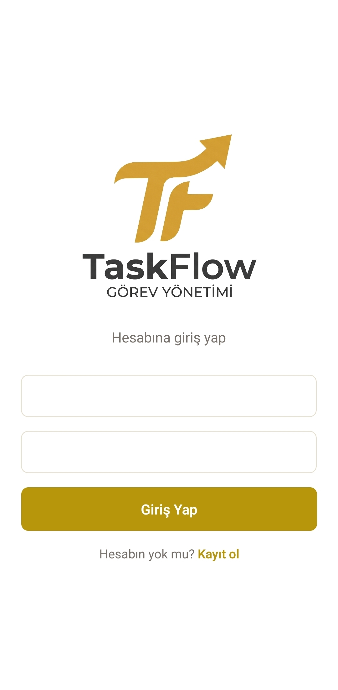
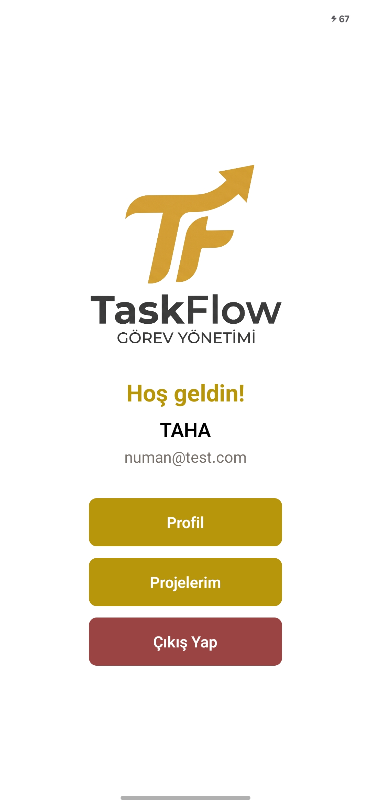
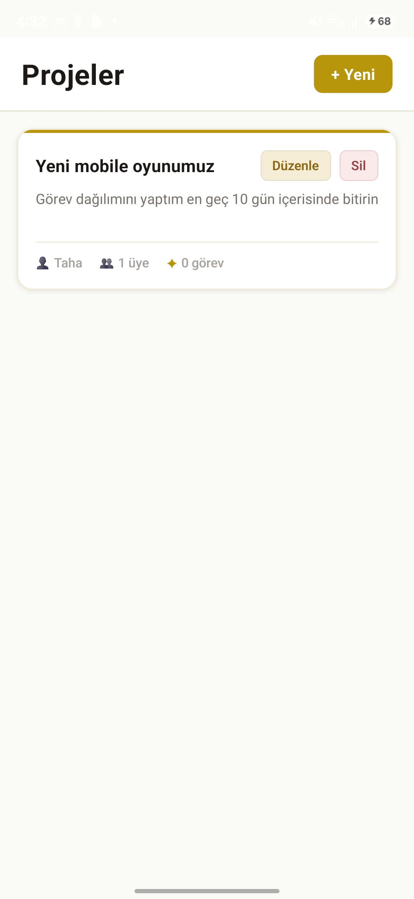
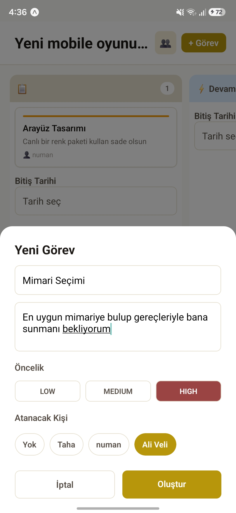
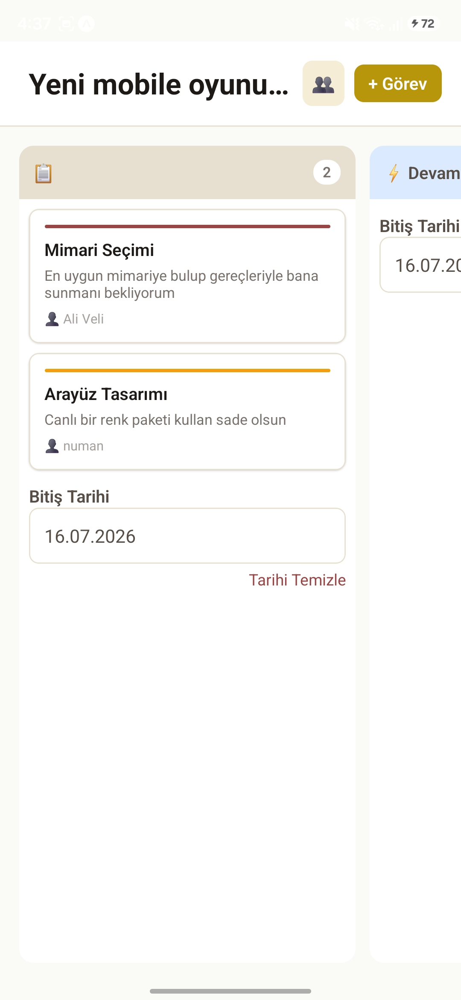
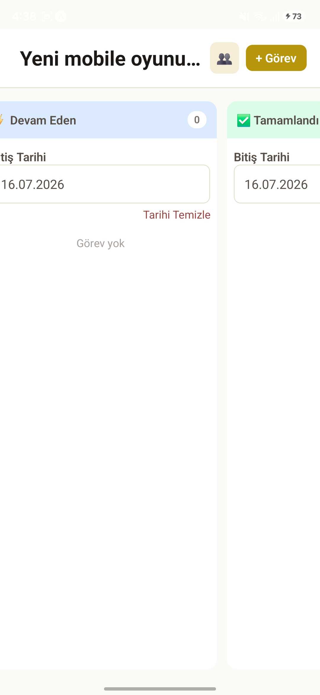

# 🚀 TaskFlow - Full Stack Project Management Application

<p align="center">
  
  <br>
  <b>React Native & Node.js tabanlı uçtan uca modern proje yönetim ve gerçek zamanlı iş takip mobil uygulaması.</b>
</p>

<p align="center">
  <a href="https://github.com/knownasnuman/taskflow/releases/tag/v1.0.0">
    
  </a>
</p>

---

## 📝 Proje Hakkında (About The Project)

**TaskFlow**, takımların veya bireysel kullanıcıların projelerini, görevlerini ve süreçlerini modern bir arayüz üzerinden gerçek zamanlı olarak yönetebilmesi için geliştirilmiş full-stack bir mobil uygulamadır. 

Backend mimarisinde **Express, Prisma 7 ve Supabase (PostgreSQL)** entegrasyonu ile güçlü, güvenli ve ölçeklenebilir bir RESTful API tasarlandı. Mobil tarafta ise **Expo Router** mimarisi ve **Zustand** state yönetimi kullanılarak akıcı bir kullanıcı deneyimi hedeflendi. Uygulamanın en belirgin özelliklerinden biri, **Socket.IO** sayesinde Kanban board üzerindeki güncellemelerin anlık (real-time) olarak tüm cihazlara yansımasıdır.

---

## 📸 Ekran Görüntüleri (Screenshots)

<p align="center">
  
  
</p>

<p align="center">
       
  
</p>

<p align="center">
  
  
  
</p>

---

## ✨ Özellikler (Features)

* 🔒 **Güvenli Kimlik Doğrulama & Yetkilendirme:** JWT tabanlı auth yapısı ve Rol Bazlı Yetkilendirme (RBAC).
* ⚡ **Gerçek Zamanlı Kanban Board:** Socket.IO entegrasyonu ile sürükle-bırak veya durum güncellemelerinde anlık veri senkronizasyonu.
* 📊 **Gelişmiş İstatistik Paneli:** Proje ve görevlerin tamamlanma oranlarını gösteren görsel grafikler ve analitik veri takibi.
* 🔑 **Güvenli Depolama:** Hassas verilerin ve kullanıcı token'larının cihaz üzerinde donanımsal şifrelemeyle saklanması için `Expo SecureStore` kullanımı.
* 🎨 **Custom UI & Pixel Art:** Özel olarak tasarlanmış pixel-art asset'ler ve modern, göz yormayan dark mode teması.
* 📅 **Takvim Entegrasyonu:** Görevlerin teslim tarihlerine (deadline) göre takvim üzerinden takibi.

---

## 🛠️ Kullanılan Teknolojiler (Tech Stack)

### Backend (Sunucu)
* **Runtime:** Node.js
* **Framework:** Express.js
* **ORM:** Prisma 7
* **Database:** Supabase (PostgreSQL)
* **Real-time:** Socket.IO
* **Authentication:** JSON Web Tokens (JWT) & bcrypt

### Mobile (Frontend)
* **Framework:** React Native (Expo)
* **Navigation:** Expo Router (File-based routing)
* **State Management:** Zustand
* **Network:** Axios
* **Secure Storage:** Expo SecureStore

### DevOps & Deployment
* **Backend Hosting:** Railway (Canlı ortam)
* **Mobile Build:** EAS (Expo Application Services) Build (Android APK)

---

## 🚀 Başlangıç (Getting Started)

Projeyi yerelde çalıştırmak için aşağıdaki adımları takip edebilirsiniz.

### Gereksinimler (Prerequisites)
* Node.js (v18+)
* npm veya yarn
* Expo Go uygulaması (fiziksel cihaz testleri için) ya da Android Emulator

### 1. Depoyu Klonlayın (Clone the Repository)
```bash
git clone [https://github.com/knownasnuman/taskflow.git](https://github.com/knownasnuman/taskflow.git)
cd taskflow
